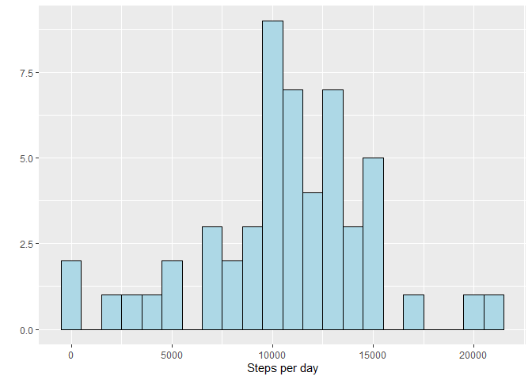
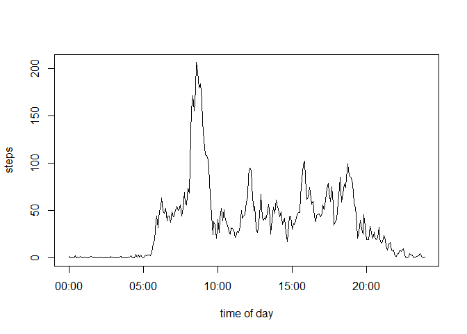
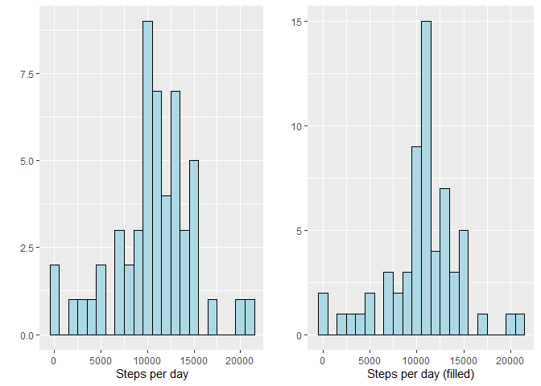
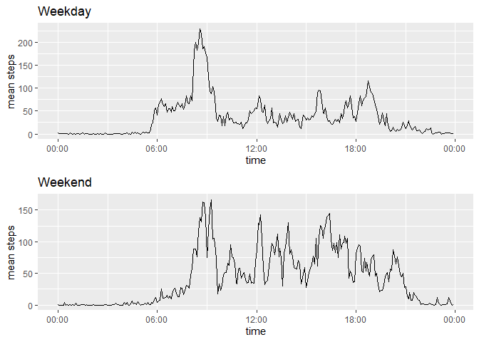

## Reproducible Research
### Activity Monitoring Data

In this assignment we are tasked to process and analyze data from a personal activity monitoring device. The device collects data at every 5 minutes interval throughout the day. There is two-months' worth of data.

#### The list of the tasks and results are as follows

### Loading and pre-processing the data

Show any code that is needed to

1. Load the data.

```r
#this line of code assumes the required file is in the working directory
dat <- read.csv("activity.csv")
```
2. Process/transform the data into a format suitable for your analysis

There is a couple of problems with the data read by read.csv() ;
The 'interval', the time interval of the day is read as an integer. We need to transform this into time object in order to plot properly, and to transform into time object, it needs to be in a format suitable for strptime(). We will therefore convert 'interval' into char object with appropriate number of 0s added to it.

```r
#preview of sample interval data
head(dat$interval, 15)
```

```
##  [1]   0   5  10  15  20  25  30  35  40  45  50  55 100 105 110
```

```r
#add zeros in front for 00:xx and 0x:xx hours
dat$interval <- sprintf("%04d",dat$interval)
#becomes
head(dat$interval)
```

```
## [1] "0000" "0005" "0010" "0015" "0020" "0025"
```

```r
#add zeros at back to represent seconds
dat$interval <- paste(dat$interval,"00",sep="")
#together with date that was read as a factor, construct a new time column
dat$time <- strptime(paste(dat$date,dat$interval),format="%Y-%m-%d %H%M%S")
#add another column of date in Date format
dat$ddate <- as.Date(dat$date)
```

## What is mean total number of steps taken per day?

For this part of the assignment, ignore the missing values in the dataset.

1. Make a histogram of the total number of steps taken per day

```r
#compute steps per day
stepsperday <- aggregate(steps ~ ddate,dat,sum)
#load 'ggplot2' package and plot
library(ggplot2)
spd <- qplot(stepsperday$steps, geom="histogram", xlab="Steps per day", binwidth=1000,fill=I("lightblue"), col=I("black"))
spd
```

<!-- -->

2. Calculate and report the **mean** and **median** number of steps taken per day

```
## [1] "Mean = 10766.1886792453"
```

```
## [1] "Median = 10765"
```

##What is the average daily activity pattern?

1. Make a time series plot (i.e. type = "l") of the 5-minute interval (x-axis) and the average number of steps taken, averaged across all days (y-axis)

```r
#create a step per interval data frame
stepsperinterval <- aggregate(steps ~ interval,dat,mean)
#convert interval to time format. date is not specified since it doesn't matter
stepsperinterval$time <- strptime(stepsperinterval$interval,format="%H%M%S")
#plot mean steps by time of day
plot(stepsperinterval$time,stepsperinterval$steps,type="l",xlab="time of day",ylab="steps")
```

<!-- -->

2. Which 5-minute interval, on average across all the days in the dataset, contains the maximum number of steps?

```
## [1] "Interval which contain the maximum number of steps is 08:35"
```

## Inputing missing values

1. Calculate and report the total number of missing values in the dataset (i.e. the total number of rows with NAs)

```
## [1] "Total number of missing values is 2304 out of 17568"
```

2. Devise a strategy for filling in all of the missing values in the dataset. The strategy does not need to be sophisticated. For example, you could use the mean/median for that day, or the mean for that 5-minute interval, etc.

For this step we will use the mean of each 5-minute interval to fill in for the missing values in corresponding intervals each day.

3. Create a new dataset that is equal to the original dataset but with the missing data filled in.

```r
#fills in missing values
datf<-dat
datf$steps[is.na(datf$steps)] <- stepsperinterval$steps[match(subset(datf,is.na(datf$steps))$interval,stepsperinterval$interval)]
```

4. Make a histogram of the total number of steps taken each day and Calculate and report the mean and median total number of steps taken per day. Do these values differ from the estimates from the first part of the assignment? What is the impact of imputing missing data on the estimates of the total daily number of steps?

```r
#calculates new steps per day
stepsperdayf <- aggregate(steps ~ ddate,datf,sum)
#plot alongside the former 'steps per day' plot for comparison
spdf <- qplot(stepsperdayf$steps, geom="histogram", xlab="Steps per day (filled)", binwidth=1000,fill=I("lightblue"), col=I("black"))
library(gridExtra)
```

```
## Warning: package 'gridExtra' was built under R version 3.6.2
```

```r
grid.arrange(spd, spdf, nrow = 1)
```

<!-- -->

```
## [1] "Old mean = 10766.1886792453"
```

```
## [1] "Old median = 10765"
```

```
## [1] "New mean = 10766.1886792453"
```

```
## [1] "New median = 10766.1886792453"
```
We can conclude that the mean and median of total number of steps per day didn't change much, but the histograms show large increase in the total number of cases, particularly around the mean/median values.

### Are there differences in activity patterns between weekdays and weekends?

For this part the weekdays() function may be of some help here. Use the dataset with the filled-in missing values for this part.

1. Create a new factor variable in the dataset with two levels -- "weekday" and "weekend" indicating whether a given date is a weekday or weekend day.


```r
#adds Weekday/Weekend column
datf$day <- weekdays(datf$ddate)
datf$day[datf$day=="Saturday" | datf$day=="Sunday"] <- "Weekend" 
datf$day[datf$day!="Weekend"] <- "Weekday" 
```

2. Make a panel plot containing a time series plot (i.e. type = "l") of the 5-minute interval (x-axis) and the average number of steps taken, averaged across all weekday days or weekend days (y-axis). 

```r
#separately calculates steps per interval for WD and WE
stepsperintervalwd <- aggregate(steps ~ interval,subset(datf,day=="Weekday"),mean)
stepsperintervalwd$time <- strptime(stepsperintervalwd$interval,format="%H%M%S")
stepsperintervalwe <- aggregate(steps ~ interval,subset(datf,day=="Weekend"),mean)
stepsperintervalwe$time <- strptime(stepsperintervalwe$interval,format="%H%M%S")

#plot
p1<-qplot(as.POSIXct(stepsperintervalwd$time),stepsperintervalwd$steps,geom="line",xlab="time",ylab="mean steps",main="Weekday")
p1 <- p1+scale_x_datetime(date_label = "%H:%M")
p2<-qplot(as.POSIXct(stepsperintervalwe$time),stepsperintervalwe$steps,geom="line",xlab="time",ylab="mean steps",main="Weekend")
p2 <- p2+scale_x_datetime(date_label = "%H:%M")
grid.arrange(p1,p2,nrow=2)
```

<!-- -->
